# applinks
*Dự án điều khiển các thiết bị và hiển thị thông tin các phòng.

-Công nghệ: React native,Firbase.

-Chức năng: 

+Đăng nhập và đăng ký tài khoản.

+Điều khiển các thiết bị bằng giọng nói(@react-native-community/voice) và button.

+Lấy vị trí hiện tại(https://www.npmjs.com/package/react-native-get-location).

+Hiển thị thời tiết hiện tại và dự báo trong ngày(https://openweathermap.org/).

+Hiển thị thông số của các phòng(https://github.com/leecade/react-native-swiper).

+Nhận thông báo từ sever(https://github.com/zo0r/react-native-push-notification).

-Giao diện app.

  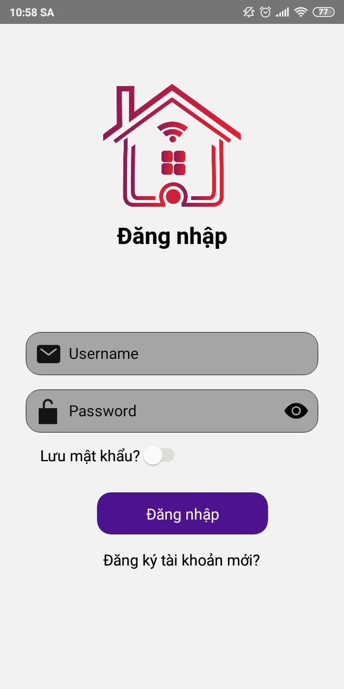 
  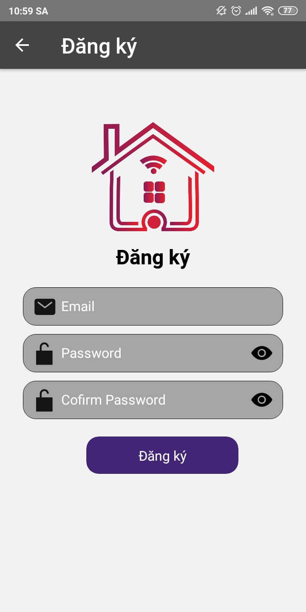 
  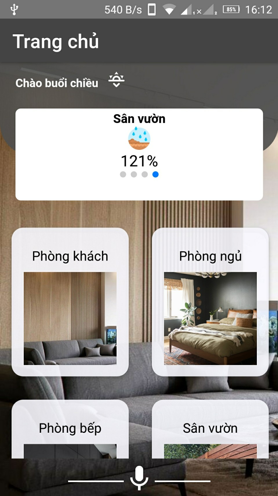 
  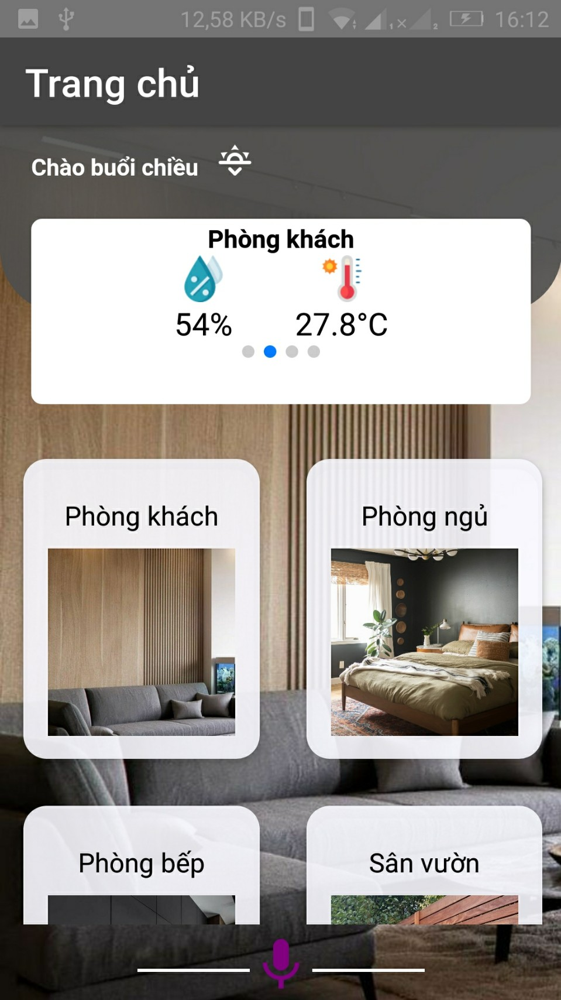 
   
  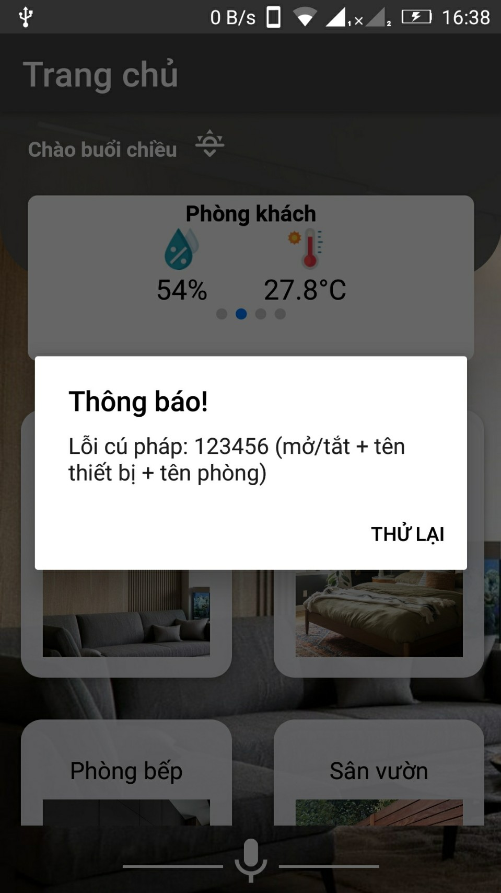 
  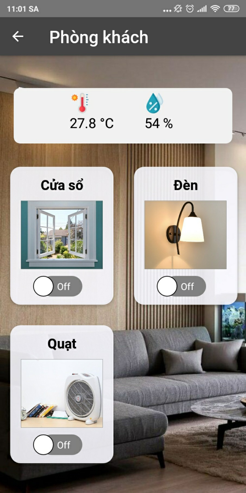 
  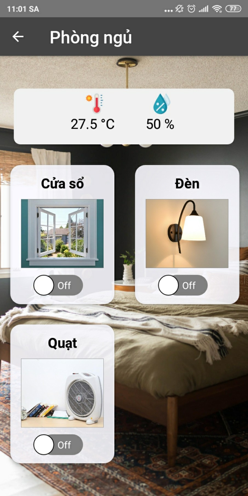 
  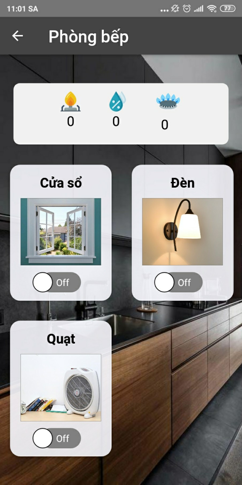 
  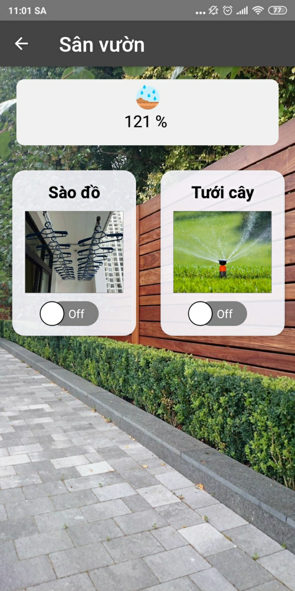 
  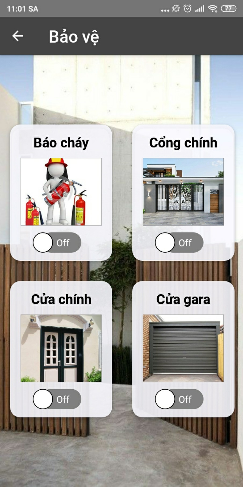 
  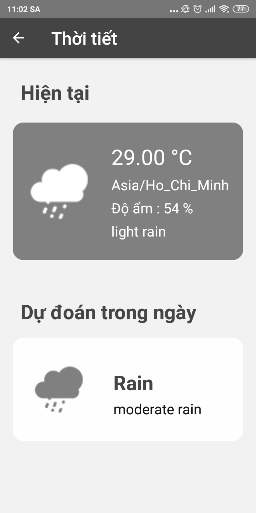 
   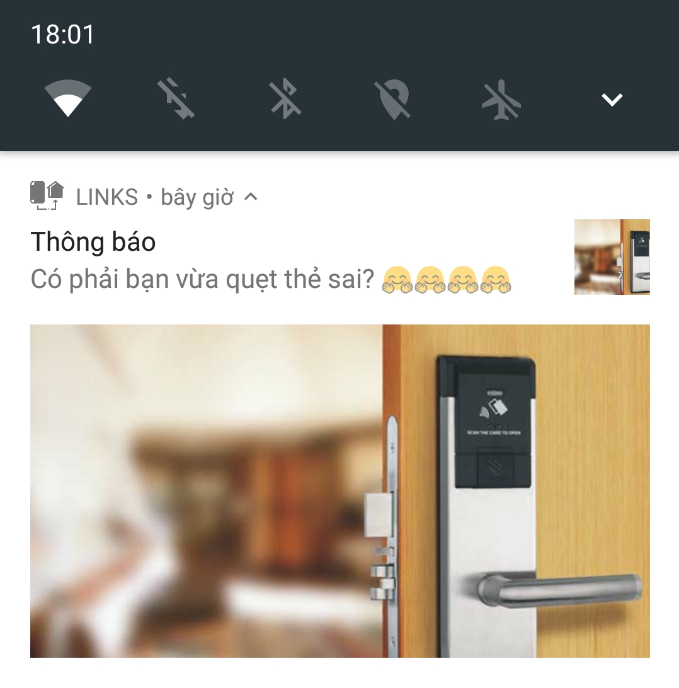 

File APK

